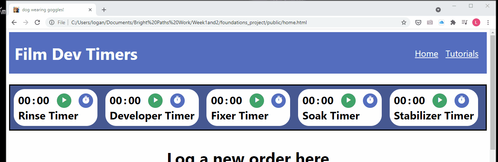
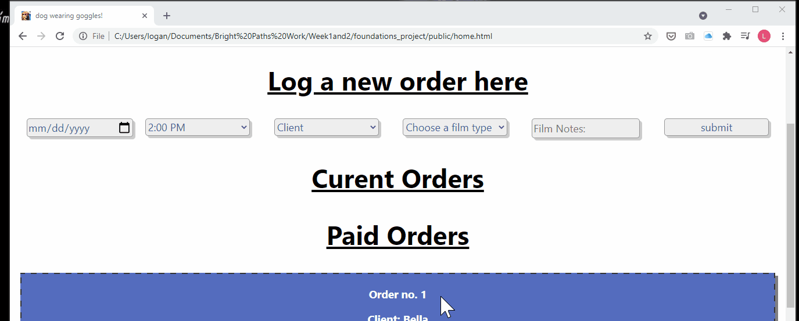
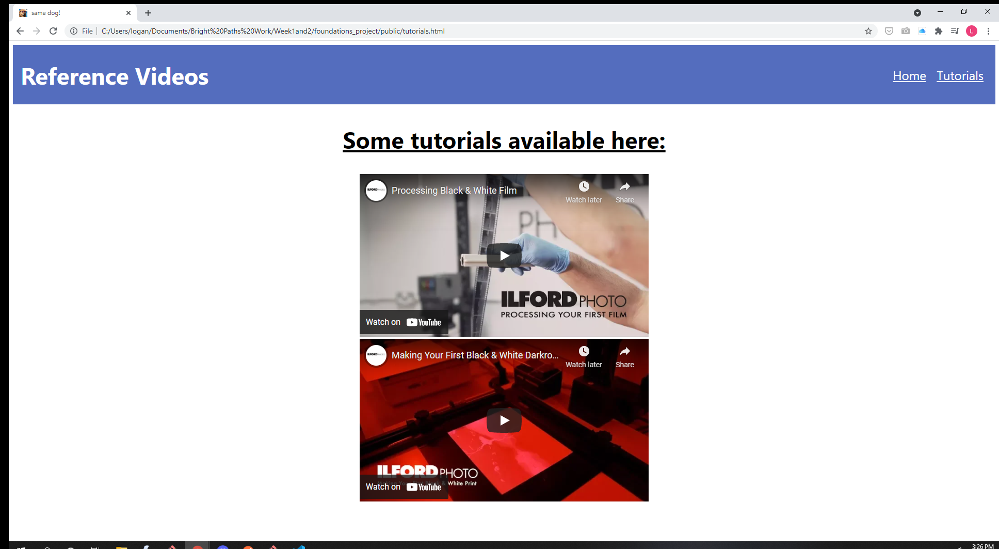

# foundations-project
# Dev-Lab Tool

This app is a tool to assist with my film development business.

## Installation

1. Clone down the repo and add your URI key and connection string in a separate .env file located in the root directory.
2. Use the package manager npm to install the project dependencies and run npm start.

```bash
npm i
npm start
```

3. Make a get request using the /seed endpoint in postman.
4. Open the home.html file in your browser.

## Usage

This app allows the user to set five separate timers for values up to 60 min. 
These timers are to assist with the chemical development process required for 35mm and 120mm film.

 / 


The app also allows the user to submit an order form for various clients in the database. The user can update the order depending on whether payment has been received.

 / 
 / 

In the tutorial.html page, the app displays a few helpful video resources for film development.
 / 
## Contributing
Phew
